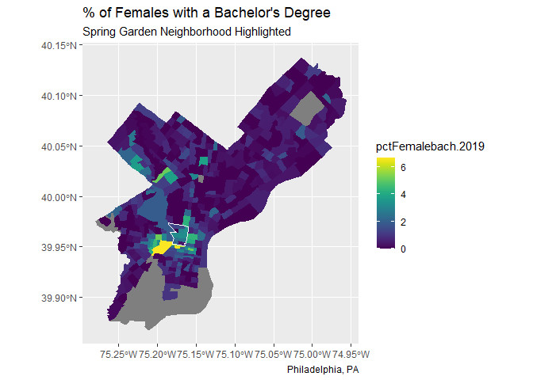

Lab 2 Assignment
================
Austin L. Wheat
9/12/2021

``` r
library(tidyverse)
library(tidycensus)
library(sf)
library(tmap)
library(viridis)
set.seed(717)
```

## Load data from {tidycensus}

``` r
vars <- load_variables(2019, "acs5") # Load Census Variables

acs_vars <- c("B15001_050", # Total Female Bachelors
              "B15001_009", # Total Male Bachelors
              "B01001_001") # ACS total Pop estimate

myTracts <- c("42101000402",
              "42101000401",
              "42101013602",
              "42101013402",
              "42101013401",
              "42101013601",
              "42101000300",
              "42101012500",
              "42101013300",
              "42101013500") # Logan Circle, Fairmount, Spring Garden area

acsTractsPHL.2019.sf <- get_acs(geography = "tract", # Load Census Tracts
                                year = 2019, 
                                variables = acs_vars, 
                                geometry = TRUE, 
                                state = "PA", 
                                county = "Philadelphia", 
                                output = "wide") %>% 
  dplyr::select (GEOID, NAME, all_of(paste0(acs_vars, "E"))) %>%
  rename (total_FemaleBach.2019 = B15001_050E,
          total_MaleBach.2019 = B15001_009E,
          total_pop.2019 = B01001_001E) %>%
  mutate(pctFemalebach.2019 = ((total_FemaleBach.2019/total_pop.2019)*100), #Do math, get %'s
         pctMalebach.2019 = ((total_MaleBach.2019/total_pop.2019)*100)) %>% #Do math, get %'s
  mutate(Neighborhood = ifelse(GEOID %in% myTracts,
                               "Logan Circle",
                               "REST OF PHILADELPHIA"))
```

    ## Getting data from the 2015-2019 5-year ACS

    ## Downloading feature geometry from the Census website.  To cache shapefiles for use in future sessions, set `options(tigris_use_cache = TRUE)`.

    ##   |                                                                              |                                                                      |   0%  |                                                                              |=                                                                     |   1%  |                                                                              |=                                                                     |   2%  |                                                                              |==                                                                    |   2%  |                                                                              |==                                                                    |   3%  |                                                                              |===                                                                   |   4%  |                                                                              |====                                                                  |   5%  |                                                                              |====                                                                  |   6%  |                                                                              |=====                                                                 |   7%  |                                                                              |======                                                                |   8%  |                                                                              |=======                                                               |   9%  |                                                                              |=======                                                               |  11%  |                                                                              |========                                                              |  11%  |                                                                              |=========                                                             |  13%  |                                                                              |==========                                                            |  14%  |                                                                              |===========                                                           |  15%  |                                                                              |============                                                          |  17%  |                                                                              |=============                                                         |  18%  |                                                                              |=============                                                         |  19%  |                                                                              |==============                                                        |  19%  |                                                                              |===============                                                       |  21%  |                                                                              |=================                                                     |  24%  |                                                                              |==================                                                    |  25%  |                                                                              |====================                                                  |  28%  |                                                                              |=====================                                                 |  30%  |                                                                              |=====================                                                 |  31%  |                                                                              |=======================                                               |  32%  |                                                                              |========================                                              |  34%  |                                                                              |========================                                              |  35%  |                                                                              |=========================                                             |  36%  |                                                                              |===========================                                           |  38%  |                                                                              |===========================                                           |  39%  |                                                                              |============================                                          |  41%  |                                                                              |==============================                                        |  42%  |                                                                              |===============================                                       |  44%  |                                                                              |===============================                                       |  45%  |                                                                              |=================================                                     |  46%  |                                                                              |==================================                                    |  49%  |                                                                              |===================================                                   |  51%  |                                                                              |=====================================                                 |  53%  |                                                                              |======================================                                |  55%  |                                                                              |========================================                              |  58%  |                                                                              |=========================================                             |  59%  |                                                                              |===========================================                           |  62%  |                                                                              |============================================                          |  63%  |                                                                              |==============================================                        |  66%  |                                                                              |===============================================                       |  68%  |                                                                              |=================================================                     |  70%  |                                                                              |==================================================                    |  72%  |                                                                              |====================================================                  |  74%  |                                                                              |=====================================================                 |  76%  |                                                                              |=======================================================               |  79%  |                                                                              |========================================================              |  80%  |                                                                              |=========================================================             |  81%  |                                                                              |==========================================================            |  83%  |                                                                              |===========================================================           |  85%  |                                                                              |=============================================================         |  87%  |                                                                              |==============================================================        |  89%  |                                                                              |================================================================      |  91%  |                                                                              |=================================================================     |  93%  |                                                                              |===================================================================   |  96%  |                                                                              |====================================================================  |  97%  |                                                                              |======================================================================| 100%

## Transform to WGS84 with {sf}

    acsTractsPHL.2019.sf_WGS84 <- acsTractsPHL.2019.sf %>% #Transform to WFS84
      st_transform(crs = "EPSG:4326")

## Plot with {ggplot2}

``` r
ggplot()+
    geom_sf(data = acsTractsPHL.2019.sf, aes(fill = pctFemalebach.2019),
            color = "transparent")+
    geom_sf(data = acsTractsPHL.2019.sf %>%
                filter(Neighborhood == "Logan Circle") %>%
                st_union(),
            color = "white",
            fill = "transparent") +
  labs(
    title = "% of Females with a Bachelor's Degree",
    subtitle = "Spring Garden Neighborhood Highlighted",
    caption = "Philadelphia, PA") +
  scale_fill_viridis()
```

<!-- -->
